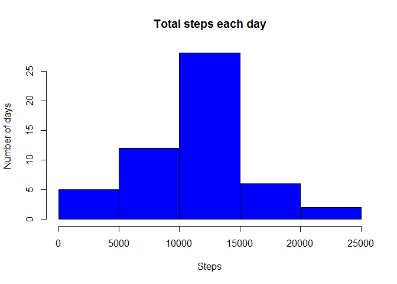
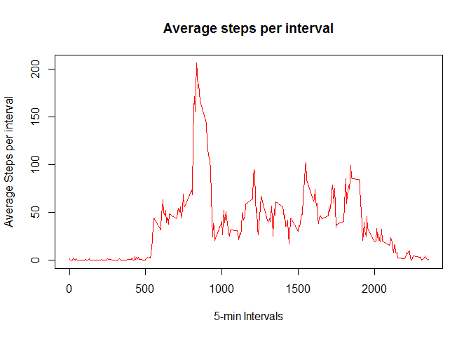
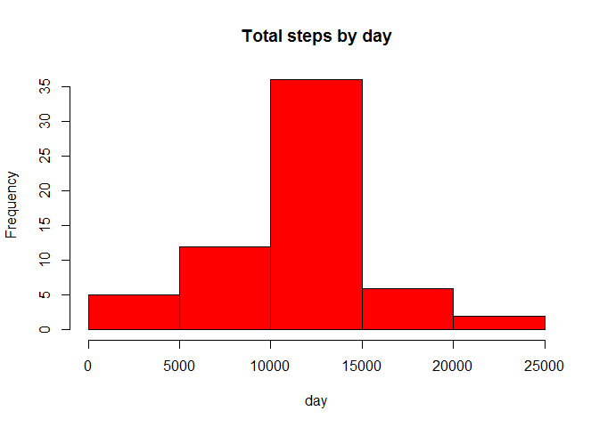
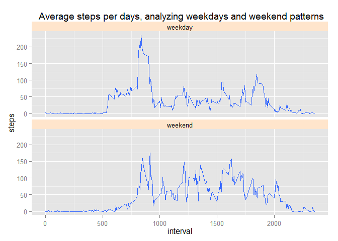

# Reproducible Research: Peer Assessment 1


## Loading and preprocessing the data

1. Load the data (i.e. read.csv())

```r
unzip("activity.zip")
activity <- read.csv("activity.csv", colClasses = c("numeric", "character", 
    "numeric"))
head(activity)
```

```
##   steps       date interval
## 1    NA 2012-10-01        0
## 2    NA 2012-10-01        5
## 3    NA 2012-10-01       10
## 4    NA 2012-10-01       15
## 5    NA 2012-10-01       20
## 6    NA 2012-10-01       25
```

```r
names(activity)
```

```
## [1] "steps"    "date"     "interval"
```

2. Process/transform the data (if necessary) into a format suitable for your analysis

```r
activity$date <- as.Date(activity$date, "%Y-%m-%d")
head(activity)
```

```
##   steps       date interval
## 1    NA 2012-10-01        0
## 2    NA 2012-10-01        5
## 3    NA 2012-10-01       10
## 4    NA 2012-10-01       15
## 5    NA 2012-10-01       20
## 6    NA 2012-10-01       25
```

## What is mean total number of steps taken per day?

1. Make a histogram of the total number of steps taken each day

```r
StepsTotal <- aggregate(steps ~ date, data = activity, sum, na.rm = TRUE)
hist(StepsTotal$steps, main = "Total steps each day", xlab = "Steps",ylab = "Number of days", col = "blue")
```

 

2. Calculate and report the mean and median total number of steps taken per day

```r
mean(StepsTotal$steps)
```

```
## [1] 10766.19
```

```r
median(StepsTotal$steps)
```

```
## [1] 10765
```

## What is the average daily activity pattern?
1. Make a time series plot (i.e. type = "l") of the 5-minute interval (x-axis) and the average number of steps taken, averaged across all days (y-axis)

```r
average_interval <- aggregate(steps ~ interval, activity, mean)
plot(average_interval, type = "l", xlab="5-min Intervals", ylab="Average Steps per interval", main="Average steps per interval",col="red")
```

 

2. Which 5-minute interval, on average across all the days in the dataset, contains the maximum number of steps?

```r
average_interval$interval[which.max(average_interval$steps)]
```

```
## [1] 835
```

## Imputing missing values
Note that there are a number of days/intervals where there are missing values (coded as NA). The presence of missing days may introduce bias into some calculations or summaries of the data.

1. Calculate and report the total number of missing values in the dataset (i.e. the total number of rows with NAs)

```r
sum(!complete.cases(activity))
```

```
## [1] 2304
```

2. Devise a strategy for filling in all of the missing values in the dataset. The strategy does not need to be sophisticated. For example, you could use the mean/median for that day, or the mean for that 5-minute interval, etc.

```r
#use the mean of the 5-minute interval to fill in the missing values
```


3. Create a new dataset that is equal to the original dataset but with the missing data filled in.

```r
#Replace NA with mean of 5-minute interval
StepsAverage <- aggregate(steps ~ interval, data = activity, FUN = mean)
fillNA <- numeric()
for (i in 1:nrow(activity)) {
    obs <- activity[i, ]
    if (is.na(obs$steps)) {
        steps <- subset(StepsAverage, interval == obs$interval)$steps
    } else {
        steps <- obs$steps
    }
    fillNA <- c(fillNA, steps)
}

#new dataset
new_activity <- activity
new_activity$steps <- fillNA
```

4. Make a histogram of the total number of steps taken each day and Calculate and report the mean and median total number of steps taken per day. Do these values differ from the estimates from the first part of the assignment? What is the impact of imputing missing data on the estimates of the total daily number of steps?

```r
#Histogram
StepsTotal2 <- aggregate(steps ~ date, data = new_activity, sum, na.rm = TRUE)
hist(StepsTotal2$steps, main = "Total steps by day", xlab = "day", col = "red")
```

 
# no difference


```r
#Mean
mean(StepsTotal2$steps)
```

```
## [1] 10766.19
```

```r
#Median
median(StepsTotal2$steps)
```

```
## [1] 10766.19
```

## Are there differences in activity patterns between weekdays and weekends?
1. Create a new factor variable in the dataset with two levels - "weekday" and "weekend" indicating whether a given date is a weekday or weekend day.

```r
activity$dayType <- ifelse(weekdays(activity$date) %in%  c("Saturday", "Sunday"),'weekend','weekday')

head(activity)
```

```
##   steps       date interval dayType
## 1    NA 2012-10-01        0 weekday
## 2    NA 2012-10-01        5 weekday
## 3    NA 2012-10-01       10 weekday
## 4    NA 2012-10-01       15 weekday
## 5    NA 2012-10-01       20 weekday
## 6    NA 2012-10-01       25 weekday
```

```r
table(activity$dayType)
```

```
## 
## weekday weekend 
##   12960    4608
```

2. Make a panel plot containing a time series plot (i.e. type = "l") of the 5-minute interval (x-axis) and the average number of steps taken, averaged across all weekday days or weekend days (y-axis). See the README file in the GitHub repository to see an example of what this plot should look like using simulated data.

```r
library(ggplot2)
```

```
## Warning: package 'ggplot2' was built under R version 3.1.2
```

```r
qplot(x=interval, y=steps,data=subset(activity, complete.cases(activity)),geom='smooth', stat='summary', fun.y=mean) + facet_grid(dayType~.) + facet_wrap(~dayType,nrow=2) + theme(strip.background = element_rect(fill="#ffe5cc")) + labs(title=' Average steps per days, analyzing weekdays and weekend patterns')
```

 
